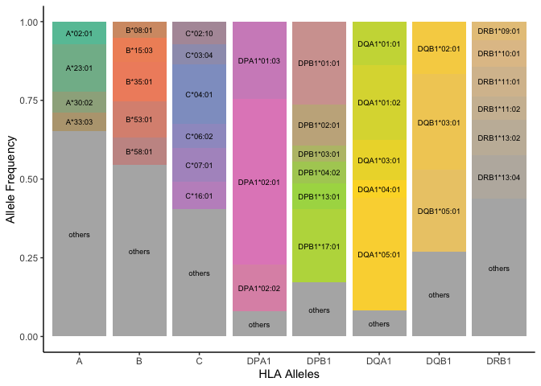
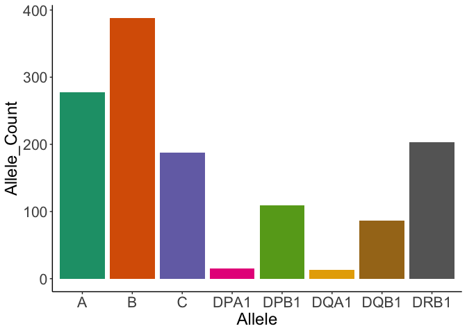
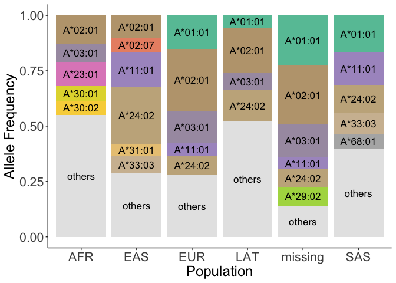

# HLADiversity

<!-- badges: start -->
<!-- badges: end -->

The goal of HLADiversity is to estimate the distinctiveness of HLA
alleles.

## Input file format

## Installation

You can install the development version of HLADiversity from
[GitHub](https://github.com) with:

``` r
devtools::install_github("yang-luo-lab/HLADiversity")
```

## Example

This is a basic example of how to run the functions:

``` r
library(HLADiversity)
```

``` r
head(calculate_HLA_frequency(reference))
#> Loading required package: pacman
#>    allele        freq count
#> 1 A*30:02 0.028009839  1207
#> 2 A*02:03 0.002784740   120
#> 3 A*02:01 0.200106748  8623
#> 4 A*01:01 0.093451221  4027
#> 5 A*24:02 0.081917757  3530
#> 6 A*02:07 0.006312076   272
```

``` r
Plot_HLA_allele_frequency(target, minFreq = 0.05)
```



``` r
Plot_HLA_allele_count(reference)
#> Warning: Expected 2 pieces. Additional pieces discarded in 1 rows [481].
#> Warning: Expected 2 pieces. Missing pieces filled with `NA` in 1 rows [757].
```



``` r
Plot_HLA_target_vs_ref(target, reference)
#> `geom_smooth()` using formula = 'y ~ x'
```


``` r
plot_HLA_Diversity(reference, gene = "A", ntop = 5)
#> Warning: Expected 2 pieces. Additional pieces discarded in 1 rows [1201].
#> Warning: Expected 2 pieces. Missing pieces filled with `NA` in 1 rows [1].
#> Warning: Expected 2 pieces. Additional pieces discarded in 1 rows [1200].
```


